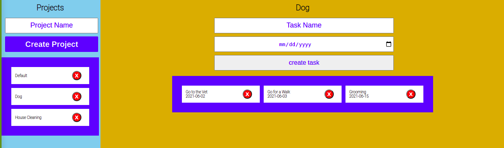

# JS-TODO List

> This is a simple list for creating projects and creating events in it to keep track of them.

This project currently features:
- A project form to create projects
- A project list, which displays current projects
- A task form, which displays when a project name is clicked
- A task list, which displays tasks created with their date.
- Every element in either list has a delete button.

## Built With

- JS
- SASS
- Node.js
- Webpack

## Live Demo

[Live Demo Link](https://upbeat-khorana-ba28be.netlify.app/)

## Getting Started

To get a local copy up and running follow these simple example steps.

### Prerequisites

- Requieres Javascript, node and a web browser

### Setup

- Clone the project from https://github.com/RokoVarano/JS-TODO_list, from the new_frontEnd branch
### Install

- Go to the clone's directory
- run 'npm run build'
- run 'npx webpack serve'
- the project will be available in localhost:8080

### Usage

- Use the Project form to create a new project.
- You can click in your project's name to display it's contents on the yellow side.
- You can use the Task form to create new Tasks.
- You can click the 'X' red button to delete a Task or a Project
### Run tests

- No tests yet
## Authors

👤 **Rodrigo Ibaceta**

- GitHub: [Rodrigo Ibateca](https://github.com/RokoVarano/)
- Twitter: [@Rodrigo](https://twitter.com/RodrigoIbacet11)
- LinkedIn: [LinkedIn](https://www.linkedin.com/in/rodrigo-ibaceta-a8657611a/)

👤 **Emanuel Okello**

- GitHub: [oxenprogrammer](https://github.com/oxenprogrammer)
- Twitter: [@ox_emmy](https://twitter.com/ox_emmy)
- LinkedIn: [Emanuel Okello](https://www.linkedin.com/in/emanuel-okello/)

## 🤝 Contributing

Contributions, issues, and feature requests are welcome!

Feel free to check the [issues page](../../issues/).

## Show your support

Give a ⭐️ if you like this project!

## Acknowledgments

- Hat tip to anyone whose code was used
- Inspiration
- etc

## 📝 License

This project is [MIT](./MIT.md) licensed.